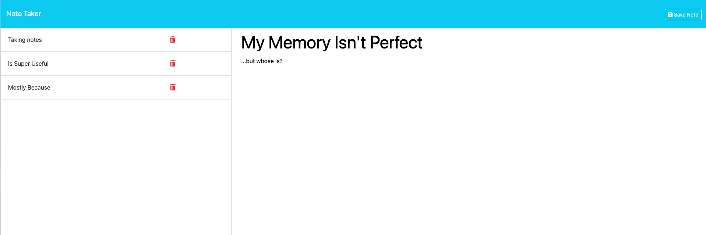

# potent-notables

## Description

A simple note-taking app that can record a note title and text, and then access and delete it later meant to demonstrate usage of Express and Heroku CLI deployment

## Usage 

Left-click the following link to visit 
[potent-notables](https://potent-notables-70e4a607105d.herokuapp.com/) hosted on Heroku, or right click to copy the URL and paste it into your browser. Click the button to enter the app, and enter a note title and text content, before clicking the save note button to save your note, which will appear in the sidebar on the left-hand side of the page on all platforms. Click the red trash can button next to an individual note in the sidebar to delete that note permanently.

## Technologies

### Heroku
### Express
### Node.js
### JavaScript
### HTML
### CSS

## Credits & Sources

Information and documentation used in the creation of this app, but external to the EdX UofT Full-Stack Software Development Bootcamp including syntaxes, best practises and instructional examples for usage came from the following sources:

- https://developer.mozilla.org/en-US/docs/Web/HTTP/Methods/DELETE
- https://www.w3schools.com/jsref/met_element_removeattribute.asp
- https://www.w3schools.com/jsref/met_element_setattribute.asp
- https://www.w3schools.com/tags/ref_httpmethods.asp
- https://www.w3schools.com/js/js_json_stringify.asp
- https://www.npmjs.com/package/generate-unique-id
- https://www.w3schools.com/jsref/api_fetch.asp
- https://expressjs.com/en/guide/routing.html
- 

## License

See LICENSE file in repository